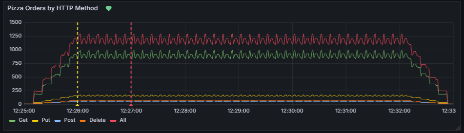

# Incident Report: Chaos Event on 2025-04-08

**Date:** 2025-04-08  
**Incident Number:** incident-2025-04-08-1   
**Status:** Resolved  

## Summary
On April 8, 2025, at 12:29:34, the `jwt-pizza-service` application experienced the chaos event injected by the AutoGrader. A `POST /api/order` request with "Veggie" pizzas failed (status 500) because the Pizza Factory returned a 503 error, due to its limit on orders with too many items. The issue was resolved by restarting the ECS task.

## Detection
- At 12:32:00, a Grafana OnCall alert ("High Failed Orders", `rate(failed{source="jwt-pizza-service"}[5m]) > 0.1`) triggered, indicating failed requests tied to the `POST /api/order` failure at 12:29:34.
- Latency spikes in Grafana around 12:29:00 prompted investigation at 12:35:00.

## Impact
- **Affected Services:** The `/api/order` endpoint failed due to a 503 error from the Pizza Factory (`https://pizza-factory.cs329.click/api/order`).
- **User Impact:** The simulated user (email `d@jwt.com`) experienced a failed order; subsequent orders succeeded.

## Timeline (Eastern Time, EST)
- **12:29:34:** Chaos event: `POST /api/order` with many items fails (status 500, Pizza Factory returns 503).
- **12:29:42:** System recovers, processing a single-item order.
- **12:32:00:** Grafana alert triggered: "High Failed Orders".
- **12:35:00:** Investigation began using Grafana and logs.
- **12:40:00:** Identified Pizza Factory failure as the cause.
- **12:45:00:** Restarted the ECS task.
- **12:50:00:** Confirmed resolution—orders and metrics normalized.

 

## Root Cause Analysis
- **Immediate Cause:** The `POST /api/order` request with many items failed due to a 503 error from the Pizza Factory.
- **Underlying Issue:** The Pizza Factory cannot handle orders with many items, a limitation exploited by the chaos test.

## Resolution
Investigation confirmed the Pizza Factory’s limitation on large orders. Restarting the ECS task ensured stability, though the system had already recovered by 12:29:42. Orders continued to work correctly.

## Prevention
- Add a way for factory requests to handle 503 errors.
- Validate order sizes.

## Action Items
- **Completed:** Restarted the ECS task.
- **To Do:**
  - Add retry logic for factory requests.
  - Implement order size validation.

## Alerting Updates
- **Current:** The "High Failed Orders" alert triggered at 12:32:00.
- **New Alerts:**
  - Pizza latency > 30ms for 5 minutes.
  - 500 status codes on `POST /api/order` > 5% over 5 minutes.
  - 503 status codes from the Pizza Factory > 1 in 5 minutes.
  - Orders with > 10 items in a single request.

